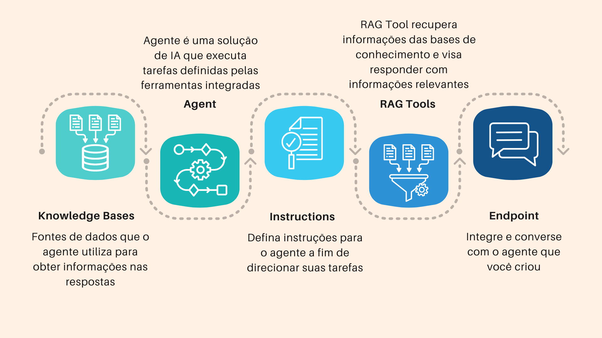

# Introdução

## Sobre o workshop

O **OCI Generative AI Agents** é um serviço totalmente gerenciado que combina LLMs, Retrieval Augmented Generation (RAG) e  orquestrador de tools, possibilitando a criação de agentes para criar agentes virtuais inteligentes. Esses agentes proporcionam **experiências personalizadas e contextualizadas** aos usuários. 

A utilização da abordagem **RAG (Retrieval-Augmented Generation)** permite que os agentes combinem geração de linguagem natural com recuperação de informações em bases de dados corporativos. Essa integração aprimora significativamente os **chatbots**, tornando-os capazes de oferecer respostas precisas, baseadas em contexto e alinhadas aos dados reais da organização.

### **Recursos principais**
Com funcionalidades avançadas, o OCI Generative AI Agents oferece uma experiência poderosa e eficiente.
- **Integração de dados e canais de interação:** Suporte a chat e API, facilitando a interação entre usuários e agentes.  
- **Respostas contextualmente relevantes:** As respostas são geradas com base em consultas inteligentes à base de conhecimento, garantindo precisão e contexto.  
- **Pesquisa híbrida:** Combina métodos léxicos e semânticos para alcançar maior assertividade nas respostas.  
- **Moderação de conteúdo:** Garante interações seguras e respeitosas com controles para entrada e saída de dados.  
- **Conversas multi-turn:** Permite que usuários façam perguntas de acompanhamento, com respostas que levam em conta o histórico da conversa.  
- **Interpretação de elementos visuais:** Capacidade de interpretar gráficos e tabelas em PDFs sem necessidade de descrições adicionais.  
- **Hiperlinks automáticos:** Os links presentes nos documentos são automaticamente extraídos e incluídos nas respostas.  

 

### **Objetivos**

O objetivo desse laborátorio é aprender como podemos construir em poucos passos um agente conversacional utilizando os documentos da sua base de conhecimento utilizando o serviço de OCI Generative AI Agent.

 

### **O que você vai aprender?**

1. Aplicar as politicas necessárias.
2. Criar um bucket e carregar os arquivos.
3. Criar uma base de conhecimento para agente.
4. Criar o agente e configurar o RAG Tools.
5. Acessar e testar o agente. 

 

### **Pré-requisitos**

Este laboratório pressupõe que você tenha:

- Uma conta Oracle Cloud
- Acesso a uma região onde o serviço de agente está disponível: **Ashburn, São Paulo, Frankfurt, Osaka, London, Chicago e Phoenix.** [Lista das regiões disponíveis](https://docs.oracle.com/en-us/iaas/Content/generative-ai-agents/overview.htm#regions) 
- Deve ter uma conta de administrador ou permissões para gerenciar alguns serviços da OCI: Policies, Generative AI Agents e Object Storage    

 

## 👥 Agradecimentos

- **Autores** - Victória Rodrigues
- **Autores Contribuintes** - Isabelle Anjos
- **Última Atualização Por/Data** - Outubro 2025

## 🛡️ Declaração de Porto Seguro (Safe Harbor)

O tutorial apresentado tem como objetivo traçar a orientação dos nossos produtos em geral. É destinado somente a fins informativos e não pode ser incorporado a um contrato. Ele não representa um compromisso de entrega de qualquer tipo de material, código ou funcionalidade e não deve ser considerado em decisões de compra. O desenvolvimento, a liberação, a data de disponibilidade e a precificação de quaisquer funcionalidades ou recursos descritos para produtos da Oracle estão sujeitos a mudanças e são de critério exclusivo da Oracle Corporation.

Esta é a tradução de uma apresentação em inglês preparada para a sede da Oracle nos Estados Unidos. A tradução é realizada como cortesia e não está isenta de erros. Os recursos e funcionalidades podem não estar disponíveis em todos os países e idiomas. Caso tenha dúvidas, entre em contato com o representante de vendas da Oracle. 