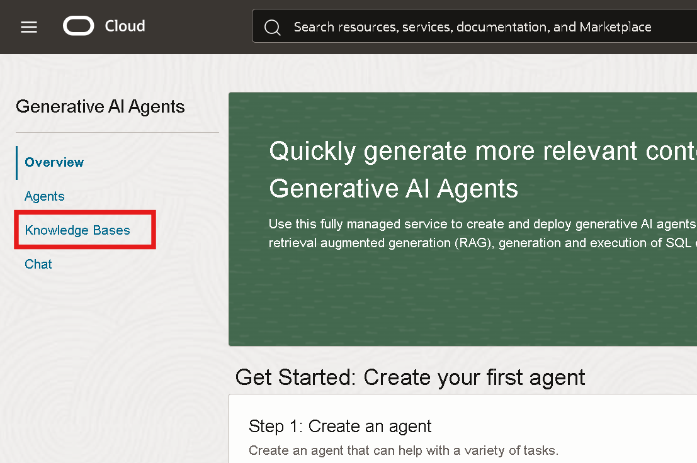
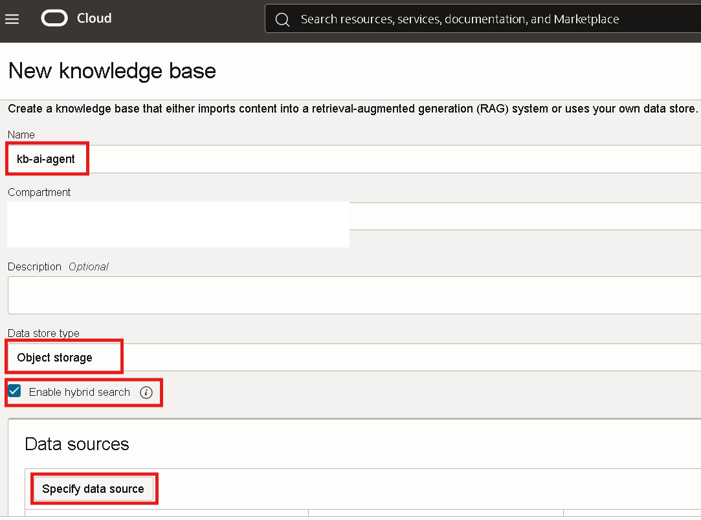
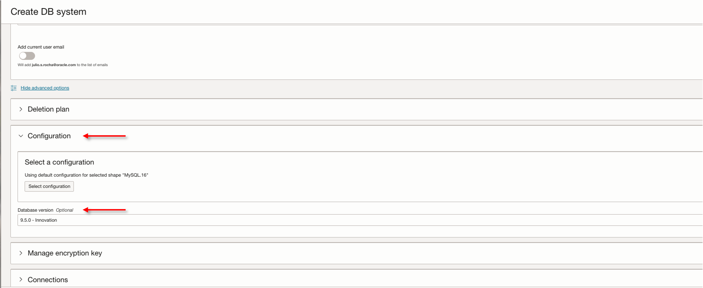

# Provisionar Base de conhecimento e MySQL HeatWave

## 📌 Introdução

Neste laboratório, você será guiado passo a passo no processo de configuração de uma base de conhecimento para Oracle Generative AI Agents, integrando fontes armazenadas no Object Storage e no banco de dados MySQL HeatWave. 

 

### 📌 **Objetivos**

Descubrar como utilizar de forma prática a funcionalidade de busca vetorial do Oracle Generative AI Agents para otimizar consultas em documentos.

O que você aprenderá:

- Criar buckets no Object Storage e realizar o upload de documentos.
- Criar a Knowledge bases utilizando object storage
- Criar uma Rede Virtual na Nuvem e permita o tráfego pela porta do Serviço de Banco de Dados MySQL HeatWave.
- Criar banco de dados MySQL HeatWave.

 

## 1️⃣ Criação de Bucket no Object Storage e Upload dos documentos

> **ATENÇÃO: Certifique-se de estar na região US Midwest (Chicago)**

Na guia do navegador com o OCI aberto, clique no menu de hambúrguer localizado no canto superior esquerdo da tela. Em seguida, selecione **Storage** e depois **Buckets**.

Clique em **Create Bucket**. Em seguida, insira um nome para o seu bucket. Recomendamos o nome **bucket-demo-ai-agent**. Finalize clicando em **Create**.

Após a criação do bucket, clique em seu nome para acessá-lo.

Neste laboratório vamos utilizar os documentos público sobre o Código de Proteção e Defesa do Consumidor, faça o download para seu computador e faça a extração dos arquivos da pasta:

- [Baixar - Documentos sobre Código de Proteção e Defesa do Consumidor](documentos/arquivos-cdc.zip)

Em seguida, acesse o bucket criado anteriormente e clique em **Objects** e **Upload objects**. 

Selecione os arquivos baixados no seu computador, **clique e arraste para a região delimitada**. Em seguida, clique em **Next** e **Upload Objects**.

 O arquivo deve aparecer em seu bucket como na imagem identificada abaixo.

## 2️⃣ Criação da Base de Conhecimento (Knowledge Base)

Clique no menu de hambúrguer localizado no canto superior esquerdo da tela. Em seguida, selecione **Analytics & AI** e depois **Generative AI Agents**.

Na página inicial do serviço, no menu à esquerda, selecione a opção **Knowledge Bases**.

Selecione **Create Knowledge Base**, conforme indicado abaixo.

Nesta tela, siga os passos abaixo:  
1. Insira o nome da sua base de conhecimento. Recomendamos utilizar **kb-ai-agent**.  
2. No campo **Data Source Type**, selecione a opção **Object Storage**.  
3. Selecione a opção **Enable Hybrid Search**, que combina pesquisa semântica (busca baseada no significado e contexto) e pesquisa lexical (busca por correspondência exata de termos), garantindo resultados mais precisos e relevantes.
4. Clique em **Specify Data Source** para configurar os arquivos que serão utilizados pelo Agent.  

Na tela seguinte, vamos definir o **Data Source**. Siga os passos abaixo:
1.  Insira o nome da sua fonte de dados. Recomendamos utilizar **kb-agent-ai**
2.  Marque a opção **Enable Multi-Modal Parsing** para permitir a interpretação de gráficos, tabelas e outros elementos visuais dos documentos.
3.  Em Select bucket, escolha o bucket previamente criado (neste exemplo, bucket-demo-ai-agent).
4.  Marque a caixa **Select all in bucket**. 
5.  Clique em **Create** para finalizar a criação da fonte de dados.

Na tela de criação da base de conhecimento, marque a opção **Automatically start ingestion job for above data sources**. Em seguida, clique em **Create**.

Verifique as mensagens no canto superior direito, indicando o sucesso na criação da base de conhecimento, da fonte de dados e do job de ingestão.

O status da base de conhecimento aparecerá como **Creating** até que o processo seja concluído, cuja média de tempo é de **20-30 minutos**. 

## 3️⃣ Crie uma Rede Virtual na Nuvem e permita o tráfego pela porta do Serviço de Banco de Dados MySQL.  

> **ATENÇÃO: Certifique-se de estar na região US Midwest (Chicago)**

Faça login em seu tenant do OCI. No **menu de navegação**, selecione **Networking > Virtual cloud networks**.

Selecione seu compartimento na lista e clique em **Start VCN Wizard**.
> **Observação: Se você não selecionou um compartimento, pode selecionar o compartimento raiz, que foi criado por padrão quando você criou sua tenancy (ou seja, quando se registrou para a conta de avaliação). É possível criar tudo no compartimento raiz, mas a Oracle recomenda que você crie subcompartimentos para ajudar a gerenciar seus recursos com mais eficiência.**

Selecione **Create VCN with Internet Connectivity** e clique em **Start VCN Wizard**.

No campo **VCN Name**, insira um nome para esta VCN e certifique-se de que o compartimento selecionado seja o correto. Mantenha as configurações padrão e clique em **Next**.

Analise as informações e clique em **Create**.

Após a criação da VCN, em **Subnets**, clique em **private subnet-< nome da VCN >**.

Personalize a lista de segurança padrão da VCN para permitir o tráfego pelas portas do serviço de banco de dados MySQL clicando em **security list for private subnet-< nome da VCN >**.

Em **Security rules**, clique em **Add Ingress Rules**.

Adicione a regra necessária à lista de segurança padrão para permitir o tráfego pela porta do serviço MySQL HeatWave e clique em **Add Ingress Rules**.

Source CIDR:

    <copy>
    0.0.0.0/0
    </copy>
<!-- Separador -->

Destination Port Range:

    <copy>
    3306,33060
    </copy>
<!-- Separador -->

Description:

    <copy>
    MySQL Ports
    </copy>
<!-- Separador -->

## 4️⃣ Criar banco de dados MySQL HeatWave

No console, clique em **Menu de navegação > Databases > DB Systems**.

Clique em **Create DB System**.

Como se trata de experimentação, escolha Desenvolvimento ou Teste .

Verifique o compartimento; ele deve ser o mesmo compartimento em que você criou a VCN e atribua um nome ao sistema de banco de dados

Na seção **Create administrator credentials**, insira o nome de usuário e escolha uma senha, mas certifique-se de anotá-la, pois você a usará mais tarde

Na **Setup** , selecione **Standalone** .

Em **Configure Netwrok**, certifique-se de selecionar a mesma VCN e a mesma subnet privada criada anteriormente.

Confirme se na seção **Configure hardware** a opção **Enable HeatWave cluster** está habilitada. 

Altere o shape do MySQL para **MySQL.16**.

Clique em **Configure HeatWave cluster** e, em seguida, clique em **Change Shape**.

Selecione **HeatWave.512GB** e clique em **Select a shape**.

Confirme se a quantidade de nós está **1**, caso contrário ajuste o valor.

Na seção **Storage size** atualize o **Initial data storage size (GB)** para **100**.

Na seção **Configure backup plan**, mantenha a janela de backup padrão de 7 dias. Desative a opção **Enable point-in-time recovery**.

Deslize a tela para baixo e clique em **Show advanced option**.

Acesse a aba **Configuration** e altere a **Database version** para **9.5.0**:

Acesse a aba **Connections** e insira o seguinte:

Hostname: 

    <copy>
    mysql-lakehouse
    </copy>
<!-- Separador -->

Database port: 

    <copy>
    3306
    </copy>
<!-- Separador -->

Database X protocol port: 

    <copy>
    33060
    </copy>
<!-- Separador -->

Após concluir, clique em **Create**.

O sistema de banco de dados MySQL estará no estado **CREATING**.

## 5️⃣ Criar JumpServer para acessar o banco de dados MySQL

No console, clique em **Menu de navegação > Databases > DB Systems**.

## 👥 Agradecimentos

- **Autores** - Victória Rodrigues, Julio Rocha
- **Última Atualização Por/Data** - Novembro 2025

## 🛡️ Declaração de Porto Seguro (Safe Harbor)

O tutorial apresentado tem como objetivo traçar a orientação dos nossos produtos em geral. É destinado somente a fins informativos e não pode ser incorporado a um contrato. Ele não representa um compromisso de entrega de qualquer tipo de material, código ou funcionalidade e não deve ser considerado em decisões de compra. O desenvolvimento, a liberação, a data de disponibilidade e a precificação de quaisquer funcionalidades ou recursos descritos para produtos da Oracle estão sujeitos a mudanças e são de critério exclusivo da Oracle Corporation.

Esta é a tradução de uma apresentação em inglês preparada para a sede da Oracle nos Estados Unidos. A tradução é realizada como cortesia e não está isenta de erros. Os recursos e funcionalidades podem não estar disponíveis em todos os países e idiomas. Caso tenha dúvidas, entre em contato com o representante de vendas da Oracle. 
