# Configuração das Permissões

## 📌 Introdução

Neste laboratório, você irá provisionar algumas permissões necessárias para executar o laboratório.

 

### 📌 **Objetivos**

O que você aprenderá:

- Criar um grupo dinamico
- Criar as politicas

 

## 1️⃣ Criação do grupo dinâmico

> **ATENÇÃO: Certifique-se de estar na região US Midwest (Chicago)**

Na guia do navegador com o OCI aberto, clique no menu de hambúrguer localizado no canto superior esquerdo da tela. Em seguida, selecione **Identity & Security** e depois **Domains**.

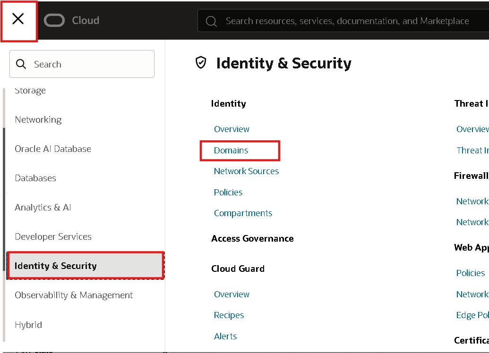

Clique em **Default**.

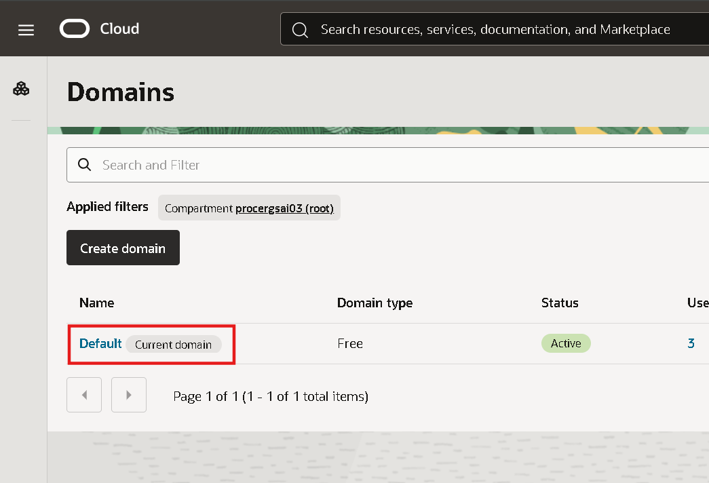

Clique em **Dynamic groups** e depois em **Create dynamic group**

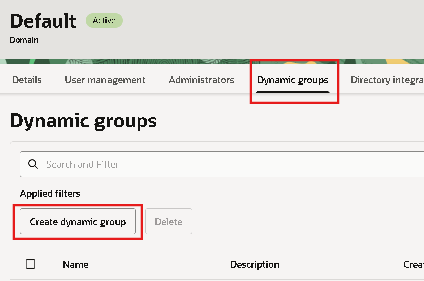

Defina o nome do grupo dinâmico como:
    
    <copy>
    dg_agente
    </copy>
<!-- Separador -->

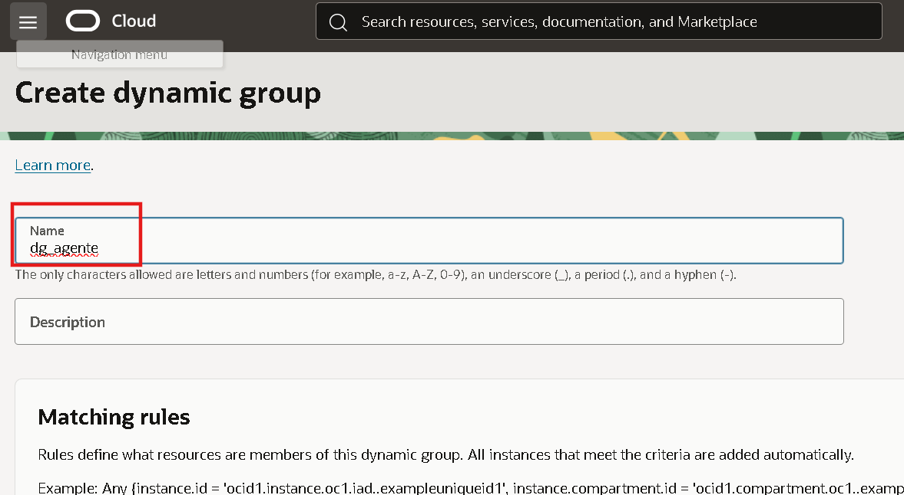

Mais abaixo insira as seguintes regras:

    <copy>
    ALL {resource.type='genaiagent'}
    </copy>
<!-- Separador -->

    <copy>
    ALL {resource.type='genaiagentdataingestionjob'}
    </copy>
<!-- Separador -->

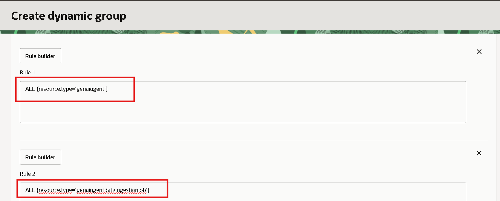

Após adicionar as regras no grupo dinâmico clique em **Create**. O resultado esperado no final é conforme mostrado na figura abaixo.

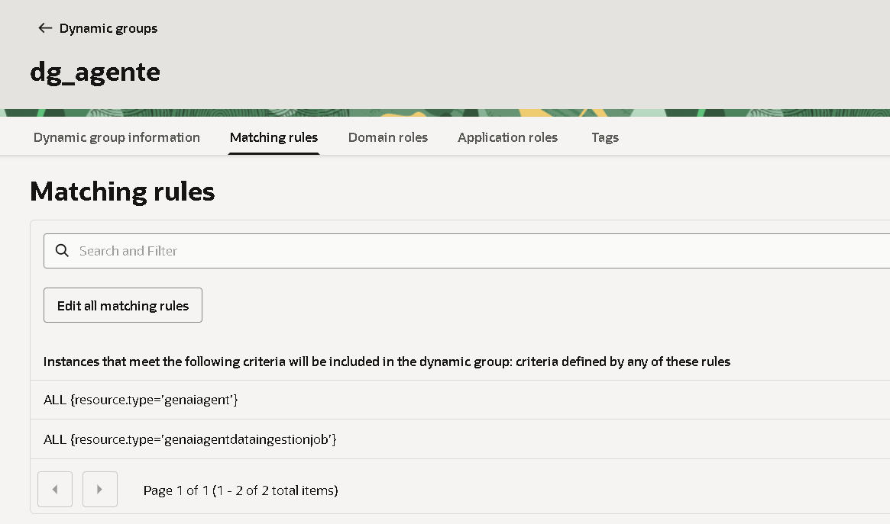

## 2️⃣ Criação das Policies

Na guia do navegador com o OCI aberto, clique no menu de hambúrguer localizado no canto superior esquerdo da tela. Em seguida, selecione **Identity & Security** e depois **Policies**.

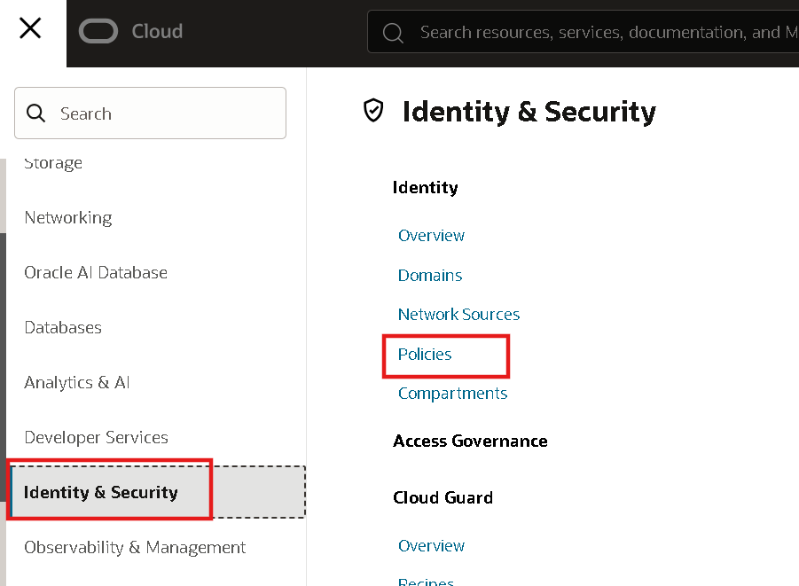

Clique no botão **Create Policy**

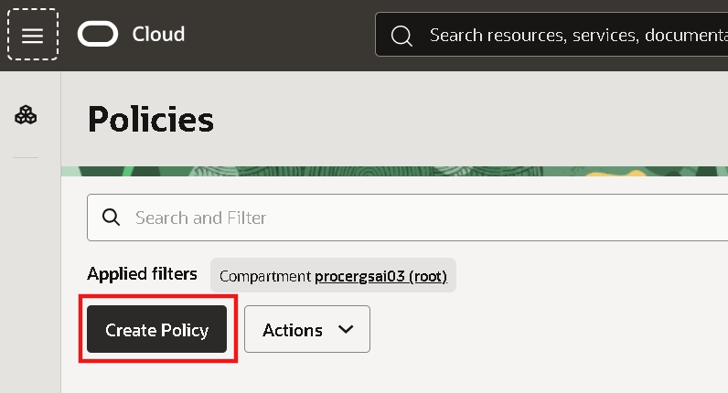

Defina o nome da politica e a descrição, e depois clique em **Show manual editor**, por exemplo:

Nome:

    <copy>
    PolicyLab
    </copy>
<!-- Separador -->

Descrição:

    <copy>
    Politicas para executar o laboratório 
    </copy>
<!-- Separador -->

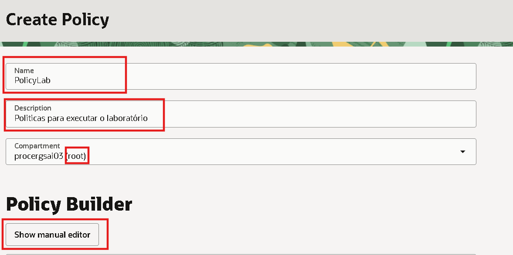

Copie e cole as politicas na área em branco:

    <copy>
    allow any-user to manage buckets in tenancy
    allow any-user to manage objects in tenancy
    allow any-user to manage database-tools-family in tenancy
    allow any-user to manage virtual-network-family in tenancy
    allow any-user to manage mysql-family in tenancy
    allow any-user to manage vaults in tenancy
    allow any-user to manage keys in tenancy
    allow any-user to manage object-family in tenancy
    allow any-user to manage genai-agent-family in tenancy
    allow dynamic-group dg_agente to manage database-tools-family in tenancy
    allow dynamic-group dg_agente to manage database-tools-connections in tenancy
    allow dynamic-group dg_agente to read secret-bundle in tenancy
    </copy>
<!-- Separador -->

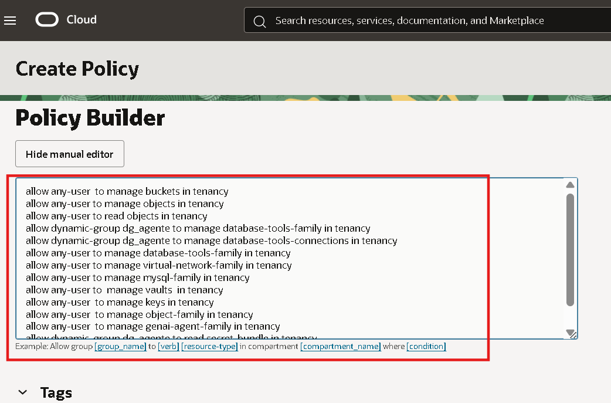

Após adicionar as politicas clique em **Create**.

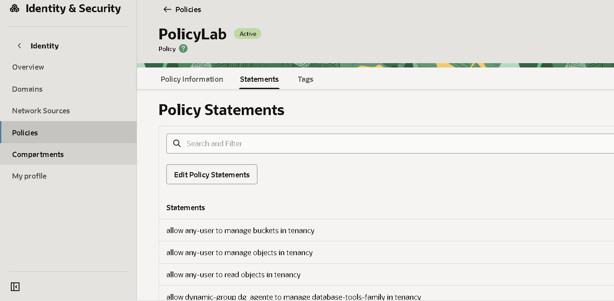

## 👥 Agradecimentos

- **Autores** - Victória Rodrigues, Julio Rocha
- **Última Atualização Por/Data** - Novembro 2025

## 🛡️ Declaração de Porto Seguro (Safe Harbor)

O tutorial apresentado tem como objetivo traçar a orientação dos nossos produtos em geral. É destinado somente a fins informativos e não pode ser incorporado a um contrato. Ele não representa um compromisso de entrega de qualquer tipo de material, código ou funcionalidade e não deve ser considerado em decisões de compra. O desenvolvimento, a liberação, a data de disponibilidade e a precificação de quaisquer funcionalidades ou recursos descritos para produtos da Oracle estão sujeitos a mudanças e são de critério exclusivo da Oracle Corporation.

Esta é a tradução de uma apresentação em inglês preparada para a sede da Oracle nos Estados Unidos. A tradução é realizada como cortesia e não está isenta de erros. Os recursos e funcionalidades podem não estar disponíveis em todos os países e idiomas. Caso tenha dúvidas, entre em contato com o representante de vendas da Oracle. 
