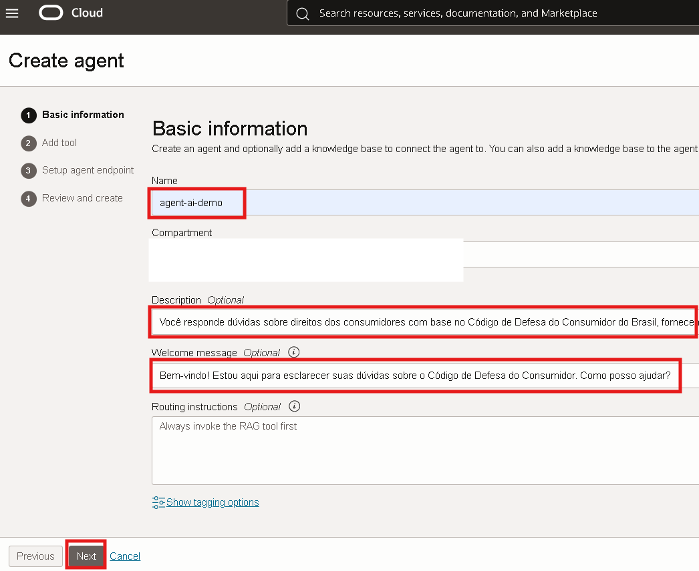

# Oracle Generative AI Agents

## 📌 Introdução

Este laboratório orienta você nas etapas para configurar um agente de IA generativa OCI, incluindo a ingestão de uma base de conhecimento no OCI Object Storage.

 

### 📌 **Objetivos**

Descubrar como utilizar de forma prática a funcionalidade de busca vetorial do Oracle Generative AI Agents para otimizar consultas em documentos.

O que você aprenderá:

- Criar buckets no Object Storage e realizar o upload de documentos.
- Configurar e utilizar o serviço OCI Generative AI Agent para criar bases de conhecimento e agentes conversacionais.
- Explorar como implementar a funcionalidade de Retrieval-Augmented Generation (RAG) para consultar documentos personalizados com eficiência e contexto.

 

## 1️⃣ Criação de Bucket no Object Storage e Upload dos documentos

> **ATENÇÃO: Certifique-se de estar na região US Midwest (Chicago)**

Na guia do navegador com o OCI aberto, clique no menu de hambúrguer localizado no canto superior esquerdo da tela. Em seguida, selecione **Storage** e depois **Buckets**.

Clique em **Create Bucket**. Em seguida, insira um nome para o seu bucket. Recomendamos o nome **bucket-demo-ai-agent**. Finalize clicando em **Create**.

Após a criação do bucket, clique em seu nome para acessá-lo.

Neste laboratório vamos utilizar os documentos público sobre o Código de Proteção e Defesa do Consumidor, faça o download para seu computador:

- [Documento 1: Perguntas frequentes sobre Código de Proteção e Defesa do Consumidor](documentos/perguntas%20frequentes%20codigo%20defesa%20do%20consumidor.pdf)
- [Documento 2: Código de Proteção e Defesa do Consumidor 2025](documentos/Codigo%20de%20defesa%20do%20consumidor%202025.pdf)
- [Documento 3: Cartilha do Consumidor](documentos/cartilha-do-consumidor-mj.pdf)
- [Documento 4: Perguntas frequentes sobre Código de Proteção e Defesa do Consumidor - Campinas](documentos/perguntas-frequentes-procon-campinas.html)
- [Documento 5: Perguntas frequentes sobre Código de Proteção e Defesa do Consumidor - Alagoas](documentos/perguntas-frequentes-procon-alagoas.html)

Em seguida, acesse o bucket criado anteriormente e clique em **Objects** e **Upload objects**. 

Selecione os arquivos PDFs baixados no seu computador, **clique e arraste para a região delimitada**. Em seguida, clique em **Next** e **Upload Objects**.

 O arquivo deve aparecer em seu bucket como na imagem identificada abaixo.

## 2️⃣ Criação da Base de Conhecimento (Knowledge Base)

Clique no menu de hambúrguer localizado no canto superior esquerdo da tela. Em seguida, selecione **Analytics & AI** e depois **Generative AI Agents**.

Na página inicial do serviço, no menu à esquerda, selecione a opção **Knowledge Bases**.

Selecione **Create Knowledge Base**, conforme indicado abaixo.

Nesta tela, siga os passos abaixo:  
1. Insira o nome da sua base de conhecimento. Recomendamos utilizar **kb-ai-agent**.  
2. No campo **Data Source Type**, selecione a opção **Object Storage**.  
3. Selecione a opção **Enable Hybrid Search**, que combina pesquisa semântica (busca baseada no significado e contexto) e pesquisa lexical (busca por correspondência exata de termos), garantindo resultados mais precisos e relevantes.
4. Clique em **Specify Data Source** para configurar os arquivos que serão utilizados pelo Agent.  

Na tela seguinte, vamos definir o **Data Source**. Siga os passos abaixo:
1.  Insira o nome da sua fonte de dados. Recomendamos utilizar **kb-agent-ai**
2.  Marque a opção **Enable Multi-Modal Parsing** para permitir a interpretação de gráficos, tabelas e outros elementos visuais dos documentos.
3.  Em Select bucket, escolha o bucket previamente criado (neste exemplo, bucket-demo-ai-agent).
4.  Marque a caixa **Select all in bucket**. 
5.  Clique em **Create** para finalizar a criação da fonte de dados.

Na tela de criação da base de conhecimento, marque a opção **Automatically start ingestion job for above data sources**. Em seguida, clique em **Create**.

Verifique as mensagens no canto superior direito, indicando o sucesso na criação da base de conhecimento, da fonte de dados e do job de ingestão.

O status da base de conhecimento aparecerá como **Creating** até que o processo seja concluído, cuja média de tempo é de **3-5 minutos**. Aguarde a finalização antes de prosseguir.

## 3️⃣ Criação do Agente de IA

No menu à esquerda, selecione a opção **Agents**. Em seguida, clique em **Create Agent**

Nesta tela, siga os seguintes passos:

1. Insira o nome do agente. Recomendamos o nome **agent-ai-demo**.
2. No campo **Description** adicione uma descrição sobre o agente:

> **Você responde dúvidas sobre direitos dos consumidores com base no Código de Defesa do Consumidor do Brasil, fornecendo respostas claras e fundamentadas na legislação. Sempre que possível, cite os artigos relevantes do CDC.**

3. No campo **Welcome Message**, insira a mensagem de boas-vindas que será exibida para o usuário ao iniciar a interação com o agente. Exemplo: 

> **Bem-vindo! Estou aqui para esclarecer suas dúvidas sobre o Código de Defesa do Consumidor. Como posso ajudar?**

4. Clique em **Next**

Na proxima tela, iremos configurar a o RAG Tool, clique em **Add Tool** e siga os passos abaixo:

1. Selecione a opção **RAG**.
2. Insira o nome do RAG. Recomendamos o nome **rag-agent**.
3. No campo **Description** insira uma descrição explicando de forma clara o que o RAG Tool pode recuperar permitindo que o agente de IA faça escolhas mais inteligentes sobre quando usá-la, garantindo respostas mais relevantes e precisas para o usuário.

>**Esta ferramenta pode recuperar informações detalhadas sobre os direitos e deveres dos consumidores conforme o Código de Defesa do Consumidor do Brasil, incluindo explicações sobre processos de reclamação, garantias, práticas comerciais, contratos, troca de produtos, reembolsos e orientações sobre como proceder em casos de descumprimento da legislação de defesa do consumidor. Ela oferece acesso a artigos específicos do CDC e interpretações confiáveis para apoiar o usuário em suas dúvidas referentes a relações de consumo no Brasil.**

4. No campo **Custom instructions** adicione instruções específicas para o agente. No exemplo, foi utilizado:

>**Você responde dúvidas sobre direitos dos consumidores com base no Código de Defesa do Consumidor do Brasil, fornecendo respostas claras e fundamentadas na legislação. Sempre que possível, cite os artigos relevantes do CDC. Responda sempre de forma clara e exclusivamente em português brasileiro.**

5. Na seção **Add Knowledge Bases**, selecione a base de conhecimento que será vinculada ao agente. Certifique-se de que a base de conhecimento está ativa. **O Lifecycle State deve aparecer como Active.**
6. Clique no botão **Add tool** para adicionar tool.

Na próxima seção, **Setup agent endpoint**, certifique-se de que a opção **Automatically create an endpoint for this agent** está marcada. Isso permitirá que o sistema crie automaticamente um endpoint para o agente, facilitando a interação com ele via API com outras aplicações.

Clique no botão **Next** e para finalizar a criação do agente clique em **Create agent**.

Nesta tela, aceite o Acordo de Licença e Política de Uso do Llama 3, o modelo de inteligência artificial utilizado pelo Agent.

No canto superior direito, verifique as mensagens de confirmação. Elas devem indicar que a criação do agente  e do endpoint foram concluídas com sucesso.

O campo **Lifecycle State** exibirá o status como **Creating**, com média de tempo  de **3-5 minutos** para finalização. Aguarde até que o status mude para **Active**, indicando que o agente está pronto para uso.

Clique no nome do agente e, em seguida, selecione a opção **Launch Chat** para iniciar a interação com o agente.

> **ATENÇÃO: Caso o agente esteja ativo e o botão não esteja disponível, acesse o menu à esquerda inferior e selecione Endpoints. Verifique se o Lifecycle State do endpoint está como Active. Se o status estiver como Creating, aguarde a finalização e atualize a página.**

## 4️⃣ Interface de Interação com o Assistente Virtual

### 🔵 **Agente e Endpoint (destacado em azul)**

> - **Agent:** Neste campo você seleciona o agente configurado para responder às suas perguntas. No exemplo, o agente selecionado é o **ai-agent**.
>  
> - **Agent Endpoint:** O endpoint associado ao agente. Este é o ponto de acesso que conecta o assistente às bases de conhecimento.

### 🔴 **Área de Chat (destacada em vermelho)**

Esta é a área principal onde você pode interagir com o agente. Aqui, o assistente exibe a mensagem de saudação que configuramos e as respostas às suas perguntas.

> -  O campo **Type a message...** é onde você insere suas perguntas. Após digitar, clique em **Submit** para enviar a mensagem.
> -  O botão **Reset chat session** permite reiniciar a sessão de chat, apagando o histórico atual de interação.

### 🟠 **Traces (destacado em laranja)**

> O painel Traces mostra detalhes técnicos de cada interação com o agente, como as **consultas realizadas, os resultados gerados e os detalhes da página e parágrafo cujas informações foram obtidas**. Este recurso é útil para analisar como o assistente processa as perguntas e recupera informações da base de conhecimento.

Na imagem abaixo, você pode observar o funcionamento do assistente virtual ao responder perguntas baseadas em diferentes documentos previamente carregados na base de conhecimento.

Exemplos de perguntas para fazer os testes:

    <copy>
    Não gostei do produto. Posso cancelar a compra?
    </copy>
<!-- Separador -->

    <copy>
    Ao abrir uma conta bancária, fui informado de que era obrigatório contratar um seguro de vida. Gostaria de saber se essa exigência por parte do banco está correta.  
    </copy>
<!-- Separador -->

    <copy>
    O cinema da minha cidade proíbe a entrada de produtos adquiridos no supermercado, obrigando os clientes a comprarem apenas os itens vendidos no local. Essa prática está correta? 
    </copy>
<!-- Separador -->

    <copy>
    A escola da minha filha está solicitando diversos materiais. Gostaria de saber quais itens podem ser incluídos legalmente na lista de material escolar.
    </copy>
<!-- Separador -->

Ao clicar em **View Citations**, você expande as referências utilizadas pelo assistente para gerar a resposta. 

Cada citação apresenta as seguintes informações:

> - **Title:** O nome do arquivo de onde a informação foi extraída.
> - **Object storage path:** O caminho do arquivo no armazenamento do OCI.
> - **Document ID:** Um identificador único do documento.
> - **Page numbers:** Indica o número da página no documento de onde a informação foi retirada.
> - **Source text:** Exibe o trecho exato do documento utilizado para compor a resposta do assistente.

🎉 Laboratório finalizado! Parabéns por concluir todas as etapas. Fique à vontade para criar novas perguntas, explorar a sua aplicação e descobrir ainda mais possibilidades com o seu assistente virtual.

Você poderá seguir para o próximo laboratório.

## 👥 Agradecimentos

- **Autores** - Victória Rodrigues
- **Autores Contribuintes** - Isabelle Anjos, Caio Oliveira, Gabriela Miyazima, Aristotelles Serra
- **Última Atualização Por/Data** - Outubro 2025

## 🛡️ Declaração de Porto Seguro (Safe Harbor)

O tutorial apresentado tem como objetivo traçar a orientação dos nossos produtos em geral. É destinado somente a fins informativos e não pode ser incorporado a um contrato. Ele não representa um compromisso de entrega de qualquer tipo de material, código ou funcionalidade e não deve ser considerado em decisões de compra. O desenvolvimento, a liberação, a data de disponibilidade e a precificação de quaisquer funcionalidades ou recursos descritos para produtos da Oracle estão sujeitos a mudanças e são de critério exclusivo da Oracle Corporation.

Esta é a tradução de uma apresentação em inglês preparada para a sede da Oracle nos Estados Unidos. A tradução é realizada como cortesia e não está isenta de erros. Os recursos e funcionalidades podem não estar disponíveis em todos os países e idiomas. Caso tenha dúvidas, entre em contato com o representante de vendas da Oracle. 
