# MySQL HeatWave como base de conhecimento do OCI AI Agent

## 📌 Introdução

Neste laboratório, você será guiado passo a passo no processo de configuração de uma base de conhecimento para Oracle Generative AI Agents, integrando fontes armazenadas no Object Storage e no banco de dados MySQL HeatWave.

 

### 📌 **Objetivos**

Descubra como realizar de forma prática a criação, configuração e utilização do MySQL Heatwave e suas funcionalidades de Generative AI.

Pré-requisitos:

- Conta de avaliação gratuita da Oracle.
- Uma instância funcional do MySQL HeatWave com o Lakehouse habilitado.
- Um agente de IA criado e configurado, caso este passo ainda não tenha sido realizado, volte à **Etapa 2: Criação e configuração do AI Agent**

 

## 1️⃣ Criar um Vault com usuário e senha do banco

Na guia do navegador com o OCI aberto, clique no menu de hambúrguer localizado no canto superior esquerdo da tela. Em seguida, selecione **Analytics & AI** e depois **Generative AI Agents**.

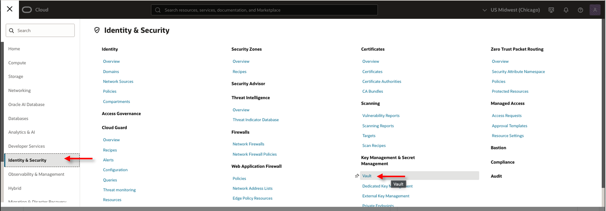

Na tela de **Vault** clique em **Create Vault**

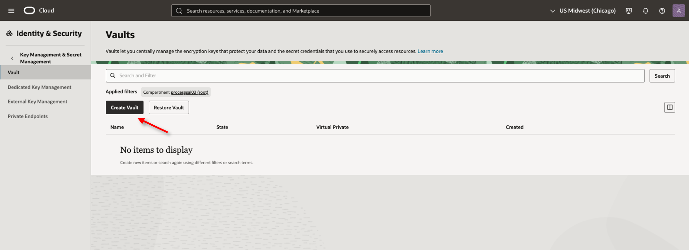

Defina um nome para o Vault e clique em **Create Vault**

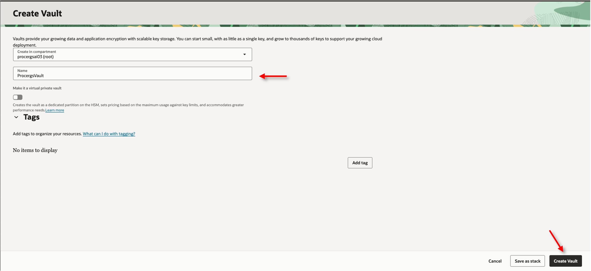

Dentro do Vault criado vá para a aba **Master encryption keys** e clique em **Create Key**

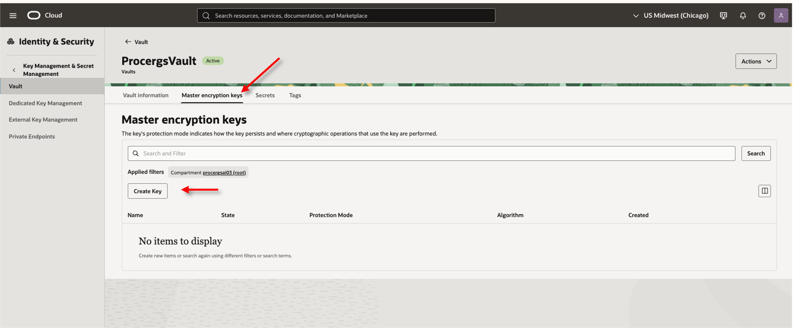

Defina um nome para a Key e clique em **Create Key**

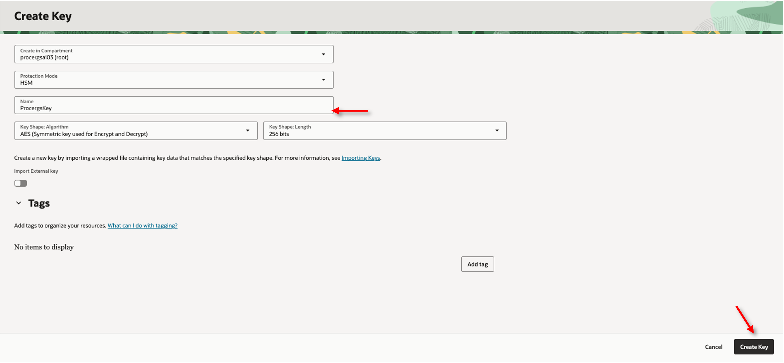

Dentro do Vault criado vá para a aba **Secrets** e clique em **Create Secret**

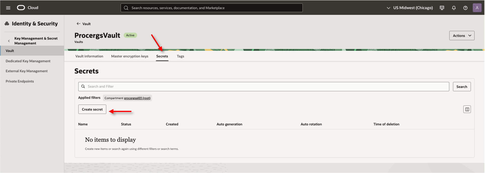

Preencha o campo **Name**, selecione a **Key** criada anteriormente em **Emcryption Key**, troque para **Manual secret generation**, preencha o campo **Secret contents** com a senha definida para o usuário administrador na criação no banco e clique em **Create**.

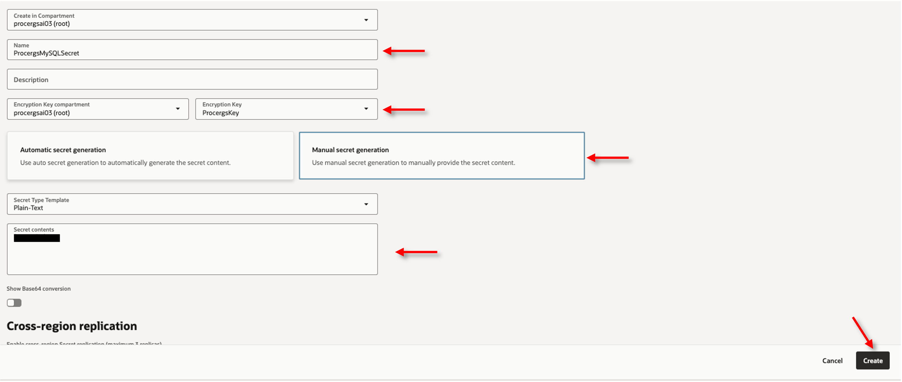

## 2️⃣ Criar conexões com as ferramentas de banco de dados

Na guia do navegador com o OCI aberto, clique no menu de hambúrguer localizado no canto superior esquerdo da tela e selecione **Developer**. Em **MySQL HeatWave**, selecione **DB Systems**.

        - Compartimento no qual o sistema de banco de dados é criado.
        - Nome do sistema de banco de dados
        - O endereço IP privado e a porta do banco de dados.
        - Nome do segredo do cofre para a senha do usuário do banco de dados

Na guia do navegador com o OCI aberto, clique no menu de hambúrguer localizado no canto superior esquerdo da tela e selecione **Developer Services**. Em **Database Tools**, selecione **Connections**.

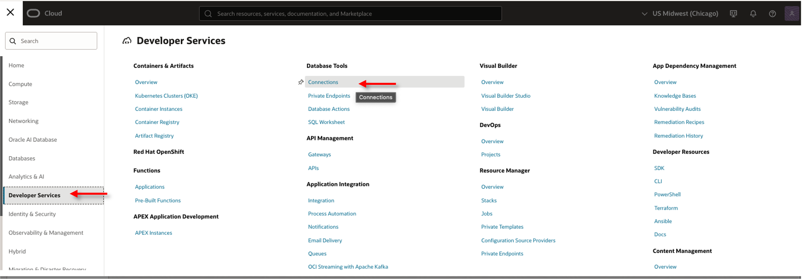

Clique em **Create Connection**

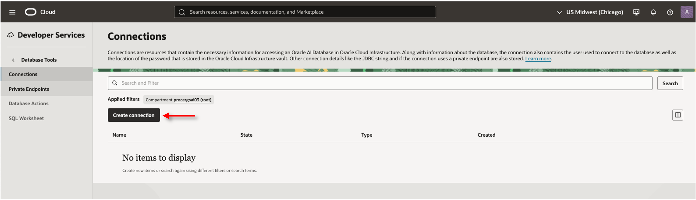

Preencha o campo **Name**, em **Database cloud service** selecione **MySQl HeatWave**, em **MySQL HeatWave** selecione o banco criado anteriormente, em **Username** adicione o nome do usuário adiminitrador definido na instanciação do banco, em **User password secret** escolha a secret criado anteriormente para esse Db System e confira se a **Connection string** está utilizando o IP Privado correto do banco.

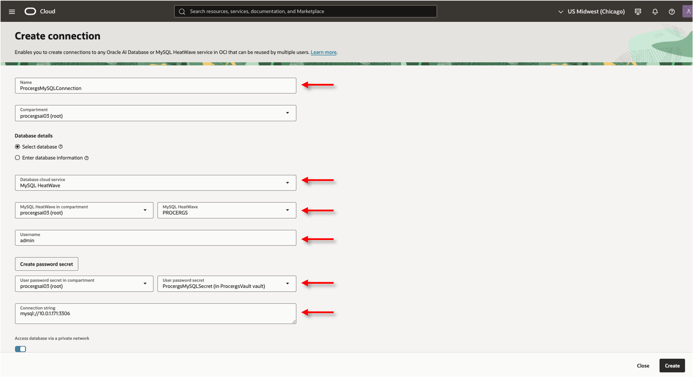

Descendo a tela clique em **Create private endpoint**

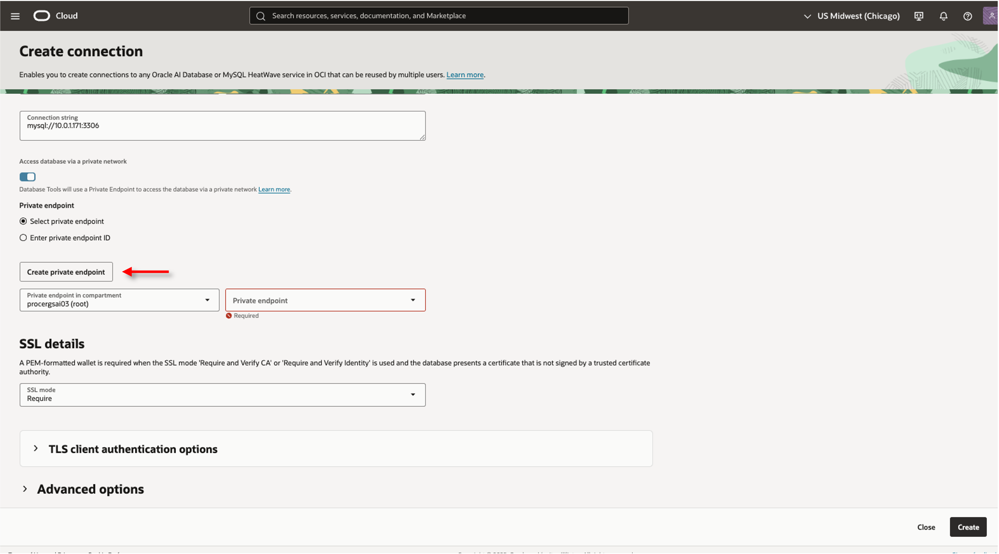

Preencha o campo **Name** e confirme que no campo **Subnet** está configurada a subnet privada criada anteriormente, então clique em **Create**

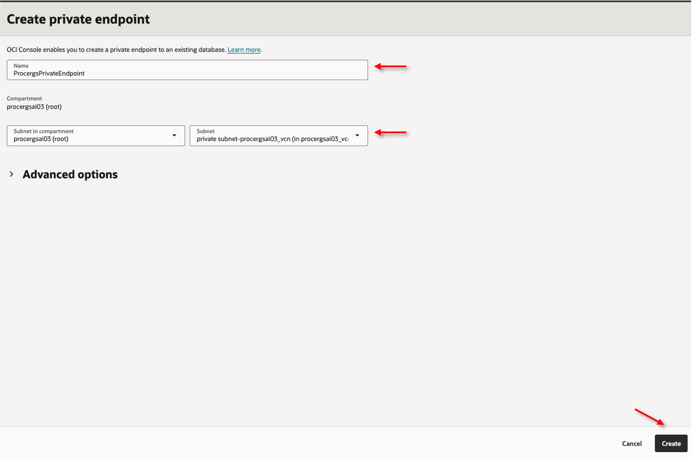

Novamente na tela de criação da Connection, selecion o **Private Endpoint** que foi criado e então clique em **Create**

## 3️⃣ Criação de uma base de conhecimento HeatWave para o Agente de IA

Uma base de conhecimento HeatWave utiliza a capacidade de busca vetorial da sua instância MySQL HeatWave. Primeiro, você precisa criar um procedimento armazenado de busca contextual na sua instância MySQL HeatWave, que será chamado pelo Agente de IA ao recuperar o contexto. Em seguida, você pode criar uma base de conhecimento e configurá-la para se conectar à sua instância MySQL HeatWave e usar o procedimento de busca contextual.

## 3️⃣.1️⃣ Criação do procedimento de busca contextual

Conecte-se no banco de dados a partir do JumpServer utilizando o seguinte comando:

    <copy>
    mysqlsh -u <usuário administrador> -h <Private IPv4 Address do MySQL> -P 3306 -p
    </copy>
<!-- Separador -->

Execute o seguinte código para criação do database e a da procedure necessários para a utilização do MySQL HeatWave como vector store do Agente de IA:

    <copy>
    CREATE DATABASE IF NOT EXISTS my_vector_store;

    DROP PROCEDURE IF EXISTS my_vector_store.context_search;

    DELIMITER $$

    CREATE PROCEDURE my_vector_store.context_search(   IN p_query TEXT,   IN top_k INT UNSIGNED,   OUT context JSON )
    SQL SECURITY INVOKER
    BEGIN
    CALL sys.ML_RAG(p_query, @ml_rag_out, JSON_OBJECT('skip_generate', true, 'n_citations', top_k));  
    SELECT JSON_ARRAYAGG(    
        JSON_OBJECT(  'SCORE', JSON_EXTRACT(obj, '$.distance'),  'DOCID', JSON_EXTRACT(obj, '$. document_name'),  'BODY',
        JSON_EXTRACT (obj, '$. segment')     )   ) INTO context  
    FROM JSON_TABLE(@ml_rag_out, '$.citations [*]' COLUMNS (     obj JSON PATH '$'   )) as jt;
    END $$

    DELIMITER ;
    </copy>
<!-- Separador -->

## 3️⃣.2️⃣ Criação da Base de Conhecimento

Na guia do navegador com o OCI aberto, clique no menu de hambúrguer localizado no canto superior esquerdo da tela. Em seguida, selecione **Analytics & AI** e depois **Generative AI Agents**.

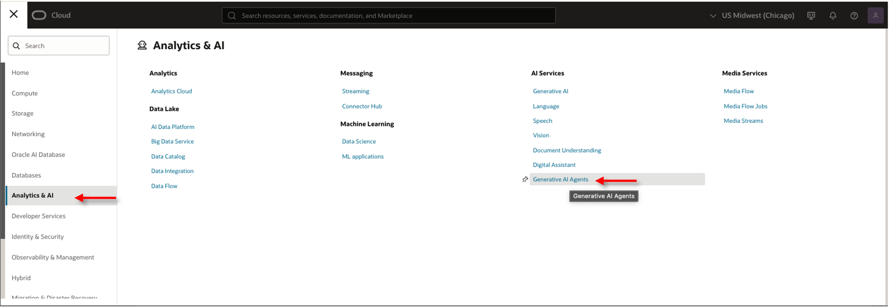

Na página **Generative AI Agents** no Console do OCI Cloud, clique no link **Knowledge Bases** e, em seguida, **Create knowledge base**.

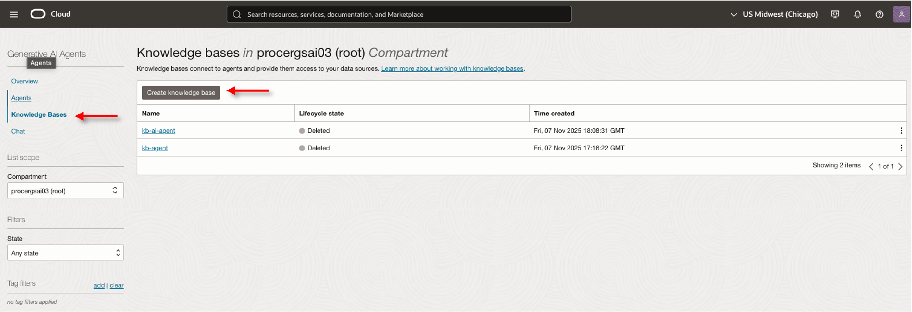

Preencha o campo **Name**, no campo **Data store type** selecione **Database Ai Vector Search**, em **Database tool connection in <nome do compartimento>** selecione a connection criada anteriormente e clique em **Test Connection**, assim que no teste aparecer como **successful** selecione a procedure criada no banco em **Vector search function** e clique em **Validate function behavior**, depois de ter como resultado **Function validation succesful** clique em **Create**.

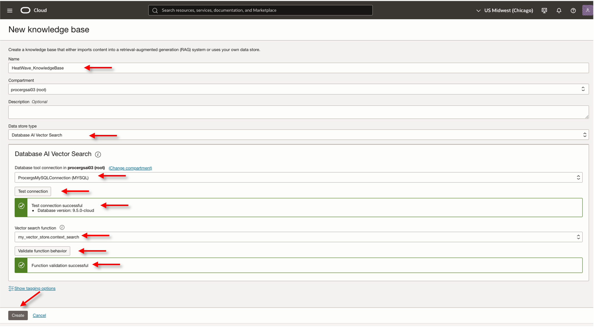

## 4️⃣ Criação de Bucket no Object Storage e Upload dos documentos

> **ATENÇÃO: Certifique-se de estar na região US Midwest (Chicago)**

Na guia do navegador com o OCI aberto, clique no menu de hambúrguer localizado no canto superior esquerdo da tela. Em seguida, selecione **Storage** e depois **Buckets**.

Clique em **Create Bucket**. Em seguida, insira um nome para o seu bucket. Recomendamos o nome **heatwave-bucket**. Finalize clicando em **Create**.

Após a criação do bucket, clique em seu nome para acessá-lo.

Neste laboratório vamos utilizar os documentos público sobre o Código de Proteção e Defesa do Consumidor, faça o download para seu computador e faça a extração dos arquivos da pasta:

- [Baixar - Documentos sobre Código de Proteção e Defesa do Consumidor](documentos/20172553-cartilha.pdf)

Em seguida, acesse o bucket criado anteriormente e clique em **Objects** e **Upload objects**. 

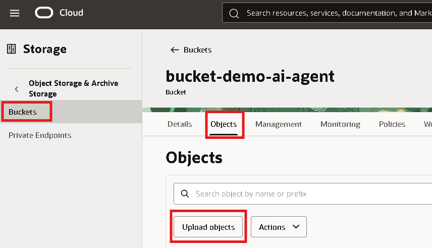

Selecione os arquivos baixados no seu computador, **clique e arraste para a região delimitada**. Em seguida, clique em **Next** e **Upload Objects**.

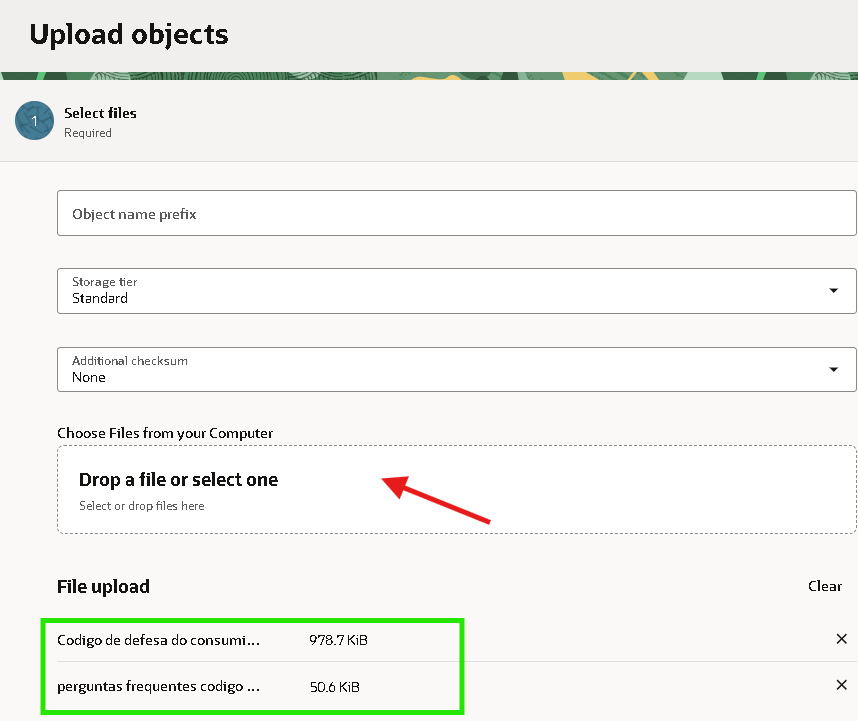

 O arquivo deve aparecer em seu bucket como na imagem identificada abaixo.

Na aba **Management**, clique em **Create pre-authenticated request**

Verifique que está preenchido o campo **Name** (altere caso prefira), confirmen que **Pre-authenticated request target** esteja como **Bucket**, **Access type** como **Permit object reads and writes** e **Enable object listing** está selecionado, então clique em **Create pre-authenticated request**.

AO clicar em **Create** uma tela aparecerá com a **Pre-authenticated request URL**, copie e guarde em um arquivo pois essa URL não aparecerá mais em nenhum lugar e será necessária no próximo passo.

## 5️⃣ Vetorização do arquivo do Bucket

Para fazer a vetorização do documento carrega do no bucket, conecte-se no banco via ssh com o seguinte comando

    <copy>
    mysqlsh -u <usuário administrador> -h <Private IPv4 Address do MySQL> -P 3306 -p
    </copy>
<!-- Separador -->

Execute o seguinte comando para gerar a vector store com os vetores do arquivo (altere o valore de **PAR_URL** para o valore coletado no passo anterior):

    <copy>
    CREATE DATABASE IF NOT EXISTS my_vector_store;

    USE my_vector_store;

    CALL sys.vector_store_load('<PAR_URL>', NULL);
    </copy>
<!-- Separador -->

Quando executada essa procedure, um select aparecerá no terminal, copie ele e execute.

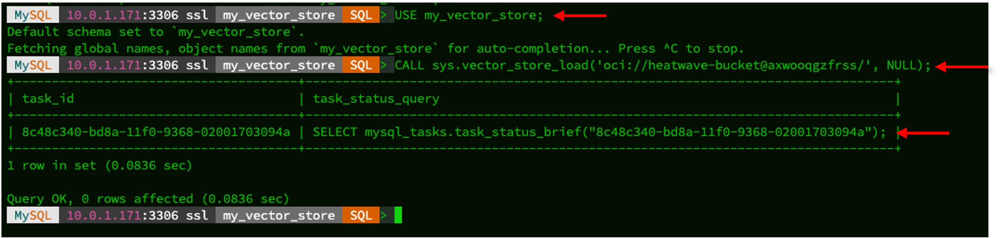

Este select irá mostrar o status da vetorização do(s) documento(s) presentes nesse bucket

Execute este select até que esteja com status de 100% completado.

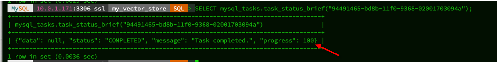

## 6️⃣ Criação da Tool no Agente de IA

Dentro do Agent criado anteriormente, na lista de **Resouces** à esquerda, selecione **Tools** e clique em **Create Tool**

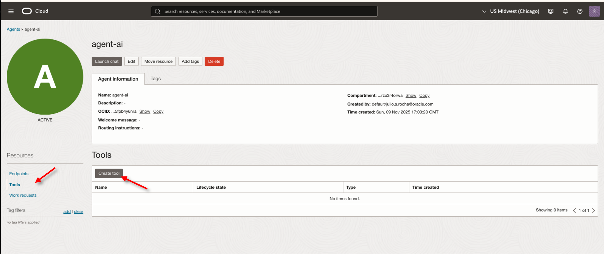

Selecione a opção **RAG**, defina um nome para a Tool em **Name** e adicione uma **Description**.

Dentro de **Add knowledge bases** selecione a base de conhecimento para o MySQL HeatWave criada anteriormente e clique em **Create tool**

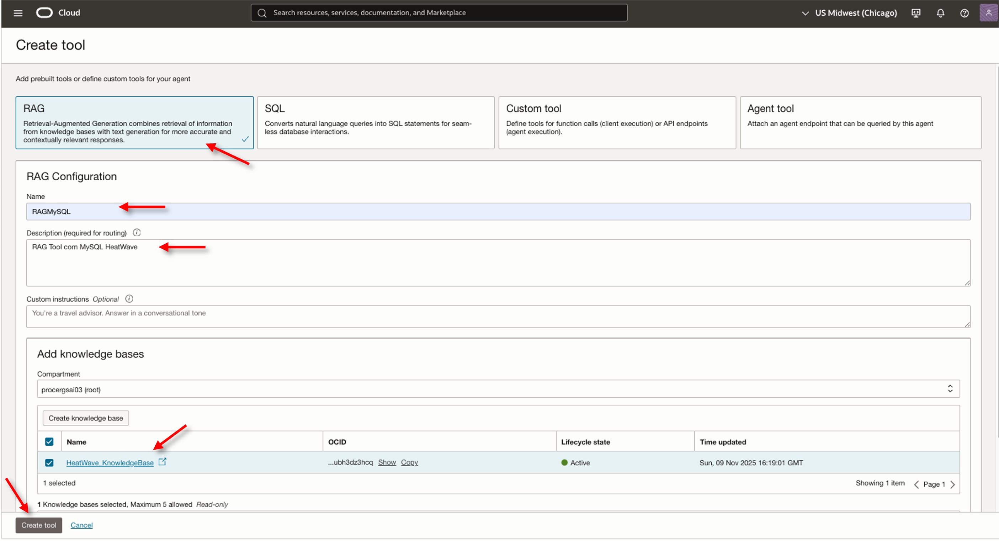

## 👥 Agradecimentos

- **Autores** - Julio Rocha
- **Última Atualização Por/Data** - Novembro 2025

## 🛡️ Declaração de Porto Seguro (Safe Harbor)

O tutorial apresentado tem como objetivo traçar a orientação dos nossos produtos em geral. É destinado somente a fins informativos e não pode ser incorporado a um contrato. Ele não representa um compromisso de entrega de qualquer tipo de material, código ou funcionalidade e não deve ser considerado em decisões de compra. O desenvolvimento, a liberação, a data de disponibilidade e a precificação de quaisquer funcionalidades ou recursos descritos para produtos da Oracle estão sujeitos a mudanças e são de critério exclusivo da Oracle Corporation.

Esta é a tradução de uma apresentação em inglês preparada para a sede da Oracle nos Estados Unidos. A tradução é realizada como cortesia e não está isenta de erros. Os recursos e funcionalidades podem não estar disponíveis em todos os países e idiomas. Caso tenha dúvidas, entre em contato com o representante de vendas da Oracle. 
